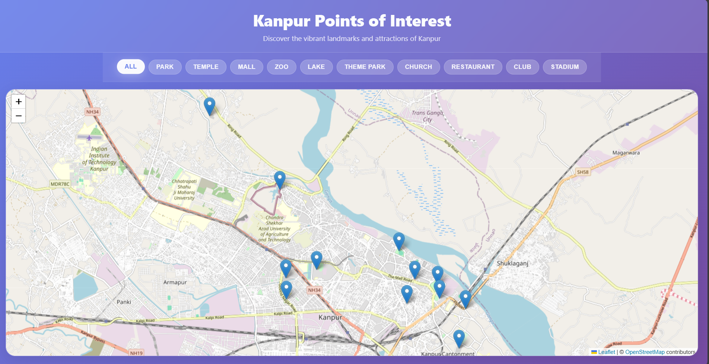
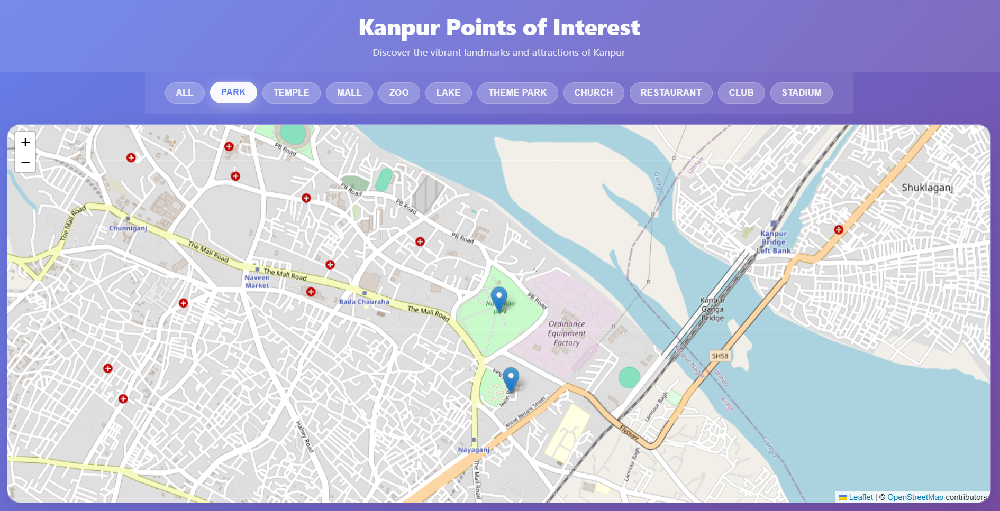

# 🗺️ Kanpur POI Map

**Kanpur POI Map** is a modern, interactive web application that showcases Points of Interest (POIs) across Kanpur, India. Built with **React** and **Leaflet.js**, the app provides users with an engaging and responsive map experience, featuring category-based filtering and detailed popups for each location.

---

## 🔗 Live Demo

🌐 [View Live Website](https://kanpur-poi.netlify.app/)

---
## 🚀 Features

- 🗺️ Interactive map with smooth zoom and pan
- 📍 13 curated POIs with custom markers and detailed info
- 🔎 Category-based filtering (parks, malls, temples, etc.)
- 📱 Fully responsive layout for desktop, tablet, and mobile
- ⚛️ Built using React Hooks and functional components
- ⚙️ Optimized performance and clean UI

---
## 📸 Preview

> *Screenshot of the app showcasing the interactive map and POI filters.*


> *Screenshot of the app showcasing POI acoordingly to filter.*



---

## 🛠️ Tech Stack

- ⚛️ **Frontend**: React 19.1.1, JavaScript, CSS3  
- 🗺️ **Mapping**: Leaflet.js, React-Leaflet, OpenStreetMap  
- 🧹 **Linting & Performance**: ESLint, Web Vitals  
- ⚙️ **Tooling**: Create React App  

---

## 📁 Project Structure

```
/src
├── App.js              # Main application logic
├── Header.js           # Header component with title
├── FilterControls.js   # Category filter buttons
├── MapContainer.js     # Map rendering and POI markers
├── poiData.js          # Static data for all POIs
├── styles.css          # Custom styles and layout
└── index.js            # Entry point
```

---

## 📦 Installation

1. **Clone the repository**
```bash
git clone https://github.com/your-username/kanpur-poi-map.git
cd kanpur-poi-map
```

2. **Install dependencies**
```bash
npm install
```

3. **Start the development server**
```bash
npm start
```

4. **Visit in your browser**
```
http://localhost:3000
```

---

## 🎯 Usage

- Filter POIs by category using the buttons  
- Click on map markers to view details  
- Responsive UI for seamless experience across devices

---

## ✅ Future Enhancements

- 🔍 Search bar for POIs  
- 🌐 Live data integration via external APIs  
- 📝 User-submitted POIs with moderation  
- 🌗 Dark/Light theme toggle

---

## 👤 Author

**Baljender Singh Bamrah**  
📧 [baljendersinghbamrah@gmail.com](mailto:baljendersinghbamrah@gmail.com)  
🔗 [LinkedIn](https://linkedin.com/in/baljender-singh-bamrah) | [GitHub](https://github.com/Baljender-Singh-Bamrah)

---

## 📄 License

This project is licensed under the [MIT License](LICENSE).
